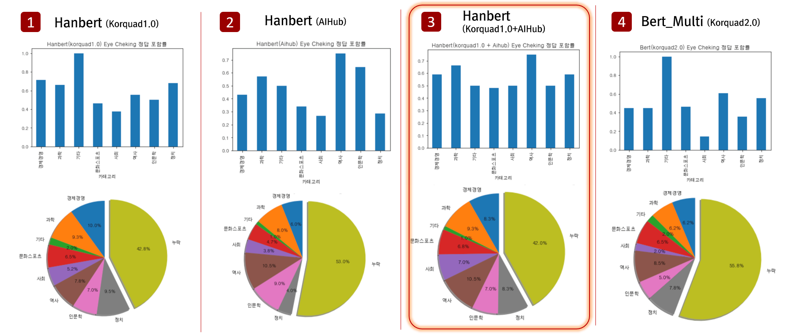

# Question & Answer System
이 프로젝트는 고려대학교 강필성 교수님의 [자연어처리](https://github.com/pilsung-kang/text-analytics) 수업에서 진행한 프로젝트입니다. 
Pre-training 모델(BERT)을 활용하여 Q&A 시스템을 개발하는 것의 가이드라인을 제공하기 위하여 기획한 프로젝트이며 제작물에서 사용한 방법론, 데이터, 코드를 다양한 곳에서 참조하여 개발하였습니다.
  


## 프로젝트 진행 영상
프로젝트와 관련된 제안, 중간, 최종 영상입니다.
1. [제안발표 영상](https://youtu.be/JQn5JIthlAI)
2. [중간발표 영상](https://youtu.be/fGQAx_wCm3E)
3. [최종발표 영상](https://youtu.be/uwzPH9xOM30)

## 시스템 설명

- 검색엔진(네이버, 구글 등)을 활용하여 '질문'에 대한 '대답' 을 찾는 시스템을 개발
- 크롤링, 전처리, 언어모델, 후처리 모듈로 시스템 구성

#### 1. Web Crawling
- 웹 검색엔진으로부터 원천소스(Reference Text)를 크롤링 하는 과정
- 웹 검색엔진의 검색엔진을 활용하여 질문에 대한 검색결과(URL) 중 상위 N개 페이지(HTML)를 크롤링
- [네이버 블로그](https://section.blog.naver.com/BlogHome.nhn?directoryNo=0&currentPage=1&groupId=0), [위키피디아](https://ko.wikipedia.org/w/index.php?search=&title=%ED%8A%B9%EC%88%98:%EA%B2%80%EC%83%89&go=%EB%B3%B4%EA%B8%B0) 두가지 검색엔진에서 크롤링
- 크롤링 모듈의 [정량적 평가 및 결과](https://github.com/JoungheeKim/korean-question-answer-system/blob/master/module_test/02_Preprocess%20Module%20Test.ipynb) 참고

#### 2. Preprocess
- 크롤링을 통해 얻은 페이지(HTML)를 줄글로 변환하는 과정
- 페이지의 구조적 특징 정보(TAG)를 토대로 문단을 분리하여 후보문단(Candidate Paragraph)을 생성
- 언어모델에 페이지의 테이블 구조, 리스트 구조 등이 반영될 수 있도록 특수토큰(Special Token) 적용
- 전처리 모듈의 [정량적 평가 및 결과](https://github.com/JoungheeKim/korean-question-answer-system/blob/master/module_test/02_Preprocess%20Module%20Test.ipynb) 참고

#### 3. Language Model
- 학습된 언어모델로 후보문단(Candidate Paragraph)에서 정답을 추출하는 과정
- 다양한 데이터셋에서 학습한 언어모델을 활용
- 후보문단들에서 각각 정답 범위(Answer Span)와 정답의 신뢰점수(Confidence Score)를 생성
- 언어모델 모듈의 [정량적 평가 및 결과](#언어-모델-실험-및-평가) 참고

#### 4. Postprocess
- 언어모델을 통해 얻은 결과물(정답, 정답의 신뢰점수)를 토대로 정답을 복원하는 과정
- 언어모델로부터 추출한 정답의 신뢰점수를 이용하여 확률이 높은 순으로 정답 범위를 정렬
- 정답 범위를 이용하여 후보문단으로부터 정답(Answer Text)를 추출
- 후처리 모듈의 [정량적 평가 및 결과](https://github.com/JoungheeKim/korean-question-answer-system/blob/master/module_test/03_QA%20Module%20Test.ipynb), [정성적 평가 및 결과](https://github.com/JoungheeKim/korean-question-answer-system/blob/master/module_test/04_QA%20Module%20Eye%20check.ipynb) 참고

## 시스템 성능 평가



## 설치 방법
```python
pip install requirements.txt
```

## 모델 학습 및 평가 방법
[Kobert](https://github.com/monologg/KoBERT-KorQuAD), [Hanbert](https://github.com/tbai2019/HanBert-54k-N) 사용방법 및 설치 방법 참고
1. 학습 명령어
```python
python run_korquad.py --model_type hanbert --model_name_or_path HanBert-54kN-torch --output_dir result/ --do_train --train_dir resource/korquad2/train/ --gradient_accumulation_steps 4 --max_seq_length 512 --logging_steps 5000 --save_steps 5000 --num_train_epochs 1 --dataset_type korquad2 --version_2_with_negative
```
2. 평가 명령어
```python
python run_korquad.py --model_type hanbert --model_name_or_path aihub/ --output_dir result/ --do_eval --predict_dir resource/korquad2/dev/ --max_seq_length 512 --dataset_type korquad2 --version_2_with_negative
```

- options
  * model_type : 모델타입(bert, kobert, hanbert) 선택 
  * model_name_or_path : 모델타입에 따라 선택(bert : bert-base-multilingual-cased, kobert : monologg/kobert, habert : HanBert-54kN-torch)하거나 모델이 있는 폴더 설정
  * output_dir : 학습 또는 평가 결과를 저장할 폴더
  * do_train : 학습 할 때 설정하는 옵션(true/false)
  * train_dir : 학습에 필요한 파일(.json)이 있는 폴더
  * do_eval : 평가 할 때 설정하는 옵션(true/false)
  * predict_dir : 평가에 필요한 파일(.json)이 있는 폴더
  * dataset_type : korquad1.0 또는 aibhub 데이터(.json)을 학습할 때는 korquad1, korquad2.0 을 학습할 때는 korquad2로 설정
  
## 언어 모델 실험 및 평가
- 총 3개 Model, 4개 Dataset에서 테스트를 진행
- Hyper-parameter를 고정하고 모델과 데이터를 변경하며 테스트를 진행
- 평가지표 (EM/F1)
  * EM : Exact Match (%)
  * F1 : F1 Score (%)
- Dataset 구성
  * korquad1.0 + aihub : korquad1.0과 Aihub 데이터를 함께 학습하고, valid 데이터로 korquad1.0 dev를 사용
  * aihub(8:2) : AIhub 데이터를 8:2나누어 train, valid 데이터로 사용
- Hyper-parameter Setting
  * max_seq_length : 512
  * max_answer_length : 100
  * batch_size : 32
  * learning_rate : 3e-5
  * max_paragraph_length : 1
  
|                         |       korquad1.0       |  korquad1.0 + aihub   |      aihub (8:2)      |      korquad2.0       |
| ----------------------- | ---------------------- | --------------------- | --------------------- | --------------------- |
| KoBERT                  | F1: 54.31 / EM: 45.30  | F1: 63.51 / EM: 53.42 | F1: 58.78 / EM: 42.48 | F1: 25.35 / EM: 20.65 |
| Bert-multilingual       | F1: 78.04 / EM: 70.69  | F1: 78.35 / EM: 71.04 | F1: 75.91 / EM: 62.37 | F1: 49.64 / EM: 43.13 |
| Hanbert                 | F1: 84.87 / EM: 78.94  | F1: 85.62 / EM: 79.63 | F1: 79.24 / EM: 66.20 | F1: 46.43 / EM: 41.12 |

## 서버 구동 방법
웹서버를 구동하기 위하여 학습된 모델이 준비되어야 합니다.
```python
python korquad_server.py --model_name_or_path aihub_model/bert --device gpu
```
- options
  - model_name_or_path : 학습한 모델이 있는 폴더
  - device : 모델 구동 환경(GPU/CPU)  |  default:gpu


## Dataset
 - [korquad1.0](https://korquad.github.io/category/1.0_KOR.html)
 - [korquad2.0](https://korquad.github.io/)
 - [Aihub 일반상식](http://www.aihub.or.kr/aidata/84)

## Reference
- [Kobert Github](https://github.com/SKTBrain/KoBERT)
- [HanBert Github](https://github.com/tbai2019/HanBert-54k-N)
- [HanBert Transformer Github](https://github.com/monologg/HanBert-Transformers)
- [KoBERT-KorQuAD Github](https://github.com/monologg/KoBERT-KorQuAD)
- [huggingface transformers Github](https://github.com/huggingface/transformers)
- [HTML Style CSS](https://webdesign.tutsplus.com/ko/tutorials/css-experiments-with-a-search-form-input-and-button--cms-22069)

