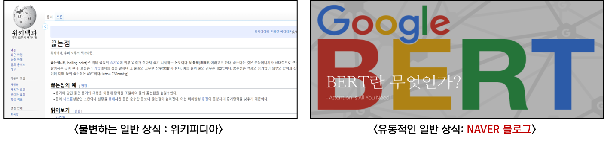

# Question & Answer System
이 프로젝트는 고려대학교 강필성 교수님의 [자연어처리](https://github.com/pilsung-kang/text-analytics) 수업에서 진행한 프로젝트입니다. 
Pre-training 모델(BERT)을 활용하여 Q&A 시스템을 개발하는 것의 가이드라인을 제공하기 위하여 기획한 프로젝트이며 제작물에서 사용한 방법론, 데이터, 코드를 다양한 곳에서 참조하여 개발하였습니다.
  

## 프로젝트 진행 영상
프로젝트와 관련된 제안, 중간, 최종 영상입니다.
1. [제안발표 영상](https://youtu.be/JQn5JIthlAI)
2. [중간발표 영상](https://youtu.be/fGQAx_wCm3E)
3. [최종발표 영상](https://youtu.be/uwzPH9xOM30)

## 시스템 설명

- 목표 : '질문'에 대한 '대답' 을 찾는 시스템을 개발
- 과정 : 1. Web Crawling  -->  2. Preprocess  -->  3. BERT Model  -->  4. Postprocess

### 1. Web Crawling
<!-- .element height="50%" width="50%" -->
- [네이버 블로그](https://section.blog.naver.com/BlogHome.nhn?directoryNo=0&currentPage=1&groupId=0), [위키피디아](https://ko.wikipedia.org/w/index.php?search=&title=%ED%8A%B9%EC%88%98:%EA%B2%80%EC%83%89&go=%EB%B3%B4%EA%B8%B0) 의 검색엔진에 질문을 넣고 상위 URL N개를 크롤링 하여 Reference Source로 활용하는 과정
- [Crawling 정량적 평가](https://github.com/JoungheeKim/korean-question-answer-system/blob/master/module_test/02_Preprocess%20Module%20Test.ipynb) 방법 및 결과 참고

### 2. Preprocess

- Crawling을 통해 얻은 Reference Source(HTML)는 독특한 구조적 특징을 갖고 있고, 이를 모델이 학습할 수 있도록 줄글로 변환하는 과정
- [Preprocess 정량적 평가](https://github.com/JoungheeKim/korean-question-answer-system/blob/master/module_test/02_Preprocess%20Module%20Test.ipynb) 방법 및 결과 참고

### 3. BERT Model
- 총 3개 Model, 4개 Dataset에서 테스트를 진행
- Hyper-parameter를 고정하고 모델과 데이터를 변경하며 테스트를 진행
- 평가지표 (EM/F1)
  * EM : Exact Match (%)
  * F1 : F1 Score (%)
- Dataset 구성
  * korquad1.0 + aihub : korquad1.0과 Aihub 데이터를 함께 학습하고, valid 데이터로 korquad1.0 dev를 사용
  * aihub(8:2) : AIhub 데이터를 8:2나누어 train, valid 데이터로 사용
- Hyper-parameter Setting
  * max_seq_length : 512
  * max_answer_length : 100
  * batch_size : 32
  * learning_rate : 3e-5
  * max_paragraph_length : 1
  
|                         |       korquad1.0       |  korquad1.0 + aihub   |      aihub (8:2)      |      korquad2.0       |
| ----------------------- | ---------------------- | --------------------- | --------------------- | --------------------- |
| KoBERT                  | F1: 54.31 / EM: 45.30  | F1: 63.51 / EM: 53.42 | F1: 58.78 / EM: 42.48 | F1: 25.35 / EM: 20.65 |
| Bert-multilingual       | F1: 78.04 / EM: 70.69  | F1: 78.35 / EM: 71.04 | F1: 75.91 / EM: 62.37 | F1: 49.64 / EM: 43.13 |
| Hanbert                 | F1: 84.87 / EM: 78.94  | F1: 85.62 / EM: 79.63 | F1: 79.24 / EM: 66.20 | F1: 46.43 / EM: 41.12 |

### 4. Postprocess

- Model을 통해 얻은 결과물(Confidence Score, Answer Position)을 후보 텍스트로 변환하고, 후보 텍스트들을 확률이 높은 순으로 정렬하는 과정
- [Postprocess 정량적 평가](https://github.com/JoungheeKim/korean-question-answer-system/blob/master/module_test/04_QA%20Module%20Eye%20check.ipynb) 방법 및 결과 참고

## 설치 방법

## 모델 학습 방법

## 서버 활용 방법

## Dataset
 - [korquad1.0](https://korquad.github.io/category/1.0_KOR.html)
 - [korquad2.0](https://korquad.github.io/)
 - [Aihub 일반상식](http://www.aihub.or.kr/aidata/84)

## Reference
- [Kobert Github](https://github.com/SKTBrain/KoBERT)
- [HanBert Github](https://github.com/tbai2019/HanBert-54k-N)
- [HanBert Transformer Github](https://github.com/monologg/HanBert-Transformers)
- [KoBERT-KorQuAD Github](https://github.com/monologg/KoBERT-KorQuAD)
- [huggingface transformers Github](https://github.com/huggingface/transformers)
- [HTML Style CSS](https://webdesign.tutsplus.com/ko/tutorials/css-experiments-with-a-search-form-input-and-button--cms-22069)

